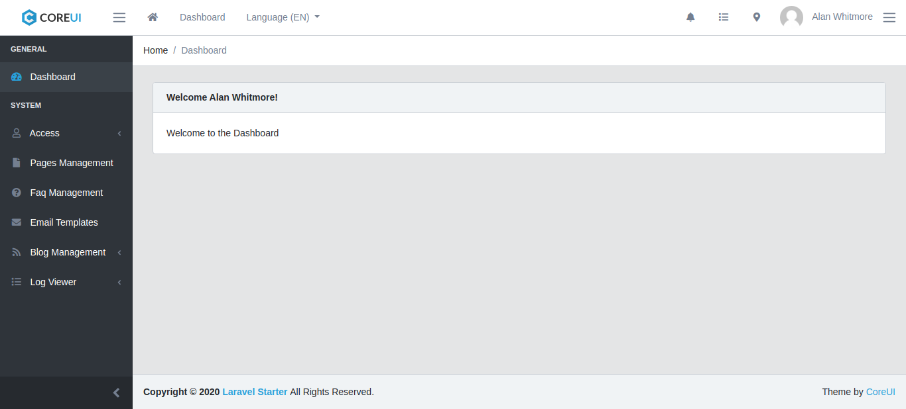
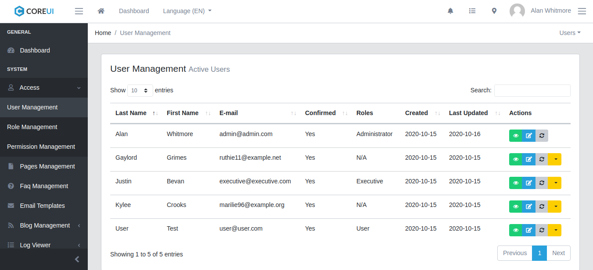
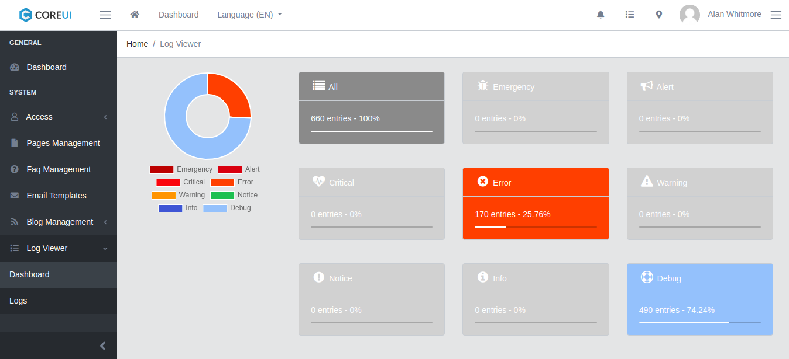

## Sitema de blog con laravel
### Setup
---
Clone the repo and follow below steps.
1. Run `composer install`
2. Copy `.env.example` to `.env` Example for linux users : `cp .env.example .env`
3. Set valid database credentials of env variables `DB_DATABASE`, `DB_USERNAME`, and `DB_PASSWORD`
4. Run `php artisan key:generate` to generate application key
5. Run `php artisan migrate`
6. Run `php artisan passport:install`
7. Run `php artisan db:seed` to seed your database
7. Run `npm i` (Recommended node version `>= V10.0`)
8. Run `npm run dev` or `npm run prod` as per your environment

Thats it... Run the command `php artisan serve` and cheers, you are good to go with your new **Laravel Admin Panel** application.

### Using docker to run the application
---
1. `docker-compose build`
2. `docker/cli composer install`
3. `docker/cli php artisan key:generate`
4. `docker/cli php artisan migrate`
5. `docker/cli php artisan passport:install`
6. `docker/cli php artisan db:seed`
7. `docker/npm i`
8. `docker/npm run dev`
9. `docker-compose up -d`

You can login to docker cli using the command `docker exec -ti ls-www /bin/bash`

*Note: Please make sure that you have proper permissions when setting up the project via docker.*

---
The application uses [GrumPHP](https://github.com/phpro/grumphp) for the git pre-commit hook and [PHPCSFixer](https://github.com/FriendsOfPHP/PHP-CS-Fixer) for the code standards. You can also bypass the `GrumPHP` pre-commit hook by hitting `git commit -n` or `git commit --no-verify`

### Demo Credentials
---
*Make sure you have run the command `php artisan db:seed --class UserTableSeeder` before you use these credentials.*

**User:** admin@admin.com\
**Password:** 1234

**User:** executive@executive.com\
**Password:** 1234

**User:** user@user.com\
**Password:** 1234

### Useful Commands
---
+ To format your code: `composer format`
+ To run the test cases: `./vendor/bin/phpunit`
    + The test cases report will be placed in the `reports` directory
+ To generate scribe API documentation: `php artisan scribe:generate`
    + Documentation will be generated and placed in the `public/docs` directory

## ScreenShots

## Dashboard

## User Listing

## Log Viewer

## Issues
If you come across any issues please report them [here](https://github.com/FTXInfotech/laravel-adminpanel/issues).

## Contribution
Feel free to create any pull requests for the project. For proposing any new changes or features you want to add to the project, you can send us an email at following addresses.

    1. Alan Whitmore - alan.whitmore@ftxinfotech.com
    2. Vicky Patel - ftx.vicky@gmail.com
